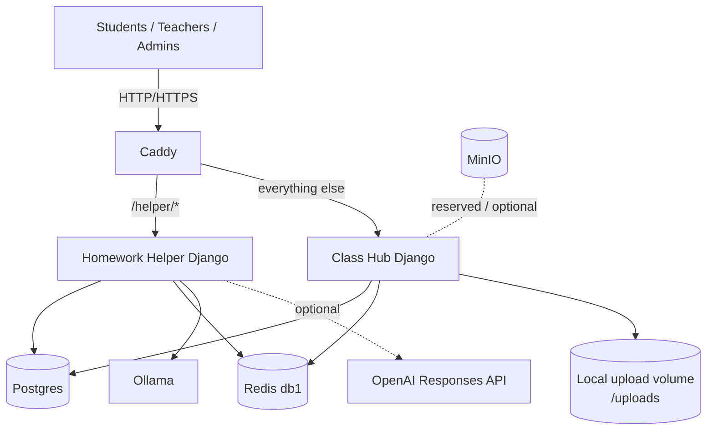
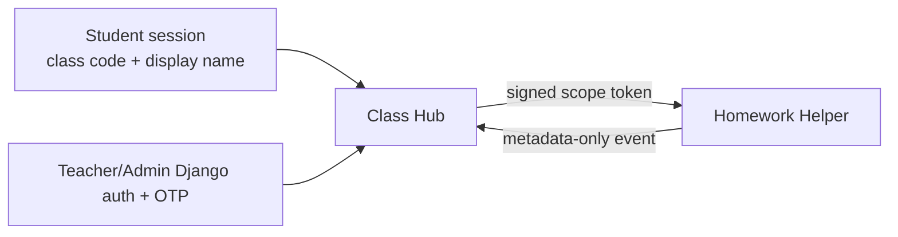

# Architecture

This system is a small self-hosted LMS stack with a split web surface:

- `Class Hub` (main LMS)
- `Homework Helper` (AI tutor under `/helper/*`)

## Runtime topology (current)

## What routes where

- Caddy handles edge traffic.
- `/helper/*` goes to Homework Helper.
- All other paths go to Class Hub.

This means helper outages are less likely to take down core LMS pages.

## Data boundaries

### Class Hub

- Owns classroom, student, module/material, submission, and teacher portal flows.
- Uses Postgres + Redis.
- Stores uploads on local mounted storage (`/uploads`), not public media routes.

### Homework Helper

- Owns helper chat policy, prompt shaping, and model backends.
- Uses Postgres + Redis for auth/session/rate-limit integration.
- Uses Ollama by default; OpenAI is optional by environment config.

## Why two Django services

1. Availability isolation: core classroom flows can remain usable when AI degrades.
2. Security boundaries: helper policy/rate-limit logic is isolated from core LMS pages.
3. Operational flexibility: helper can evolve independently (model/backend changes).

## Deployment model

- Production images bake service code and curriculum content from repo.
- Gunicorn serves Django in containers.
- Local dev uses compose override + bind mounts for fast iteration.

See:

- `docs/DEVELOPMENT.md` for local workflow
- `docs/RUNBOOK.md` for operations
- `compose/docker-compose.yml` for source-of-truth wiring
