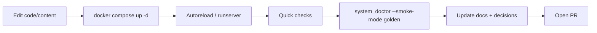

# Development

This repo is optimized for **fast local iteration** with Docker Compose.
By default, Docker Compose will load `compose/docker-compose.override.yml`
if it exists, which enables hot reload for Django code and templates.

Docs are first-class in this repo. If you change behavior, update docs in the
same branch. Start with:



- `docs/README.md` (documentation contract)
- `docs/START_HERE.md` (navigation map)
- `docs/TEACHING_PLAYBOOK.md` (teaching-quality writing standards)
- `docs/MERGE_READINESS.md` (merge gate expectations)

## Hot reload (local dev)

The override file:

- bind-mounts the source into the containers
- runs Django's dev server (`runserver`)
- sets `DJANGO_DEBUG=1`

Start the stack:

```bash
cd compose
docker compose up -d
```

Then edit files under:

- `services/common/` (shared request safety helpers)
- `services/classhub/` (Class Hub Django app)
- `services/homework_helper/` (Homework Helper Django app)
- `services/classhub/content/` (markdown course packs)

Django's autoreloader will pick up Python + template changes, and the
lesson pages read markdown files from disk on each request.

## Local LLM (Ollama)

By default, the helper uses Ollama. Make sure the model server is running:

```bash
cd compose
docker compose exec ollama ollama pull llama3.2:1b
```

If you run Ollama outside of Compose, set `OLLAMA_BASE_URL` in `compose/.env`
so the container can reach it.

## Lesson front matter hygiene

Lesson front matter values containing colons must be quoted (e.g., `title: "Save privately: Download..."`).
Run `scripts/quote_lesson_frontmatter.py` after editing any lesson file to auto-quote those values.

`hub.views` now validates front matter before parsing, so you get a clear `500` and the offending
line if you forget to quote something.

## Content-only updates

If you only want curriculum hot reload (not Python code), you can mount
just the content directory instead of the full app:

```yaml
services:
  classhub_web:
    volumes:
      - ../services/classhub/content:/app/content
      - ../data/classhub_uploads:/uploads
```

## Rebuild course pack in DB

When lesson markdown or `course.yaml` changes, re-import the course pack
to refresh Modules + Materials for a class:

```bash
CLASS_CODE=BZ2CYTTE scripts/rebuild_coursepack.sh
```

You can also pass flags directly:

```bash
scripts/rebuild_coursepack.sh --course-slug piper_scratch_12_session --class-code BZ2CYTTE
```

To create a brand-new class from the course title:

```bash
scripts/rebuild_coursepack.sh --course-slug piper_scratch_12_session --create-class
```

## When rebuilds are required

You **still** need an image rebuild when you change:

- `requirements.txt` (Python dependencies)
- Dockerfiles or OS-level packages
- production-only assets that rely on `collectstatic`

For production-style builds:

```bash
cd compose
docker compose up -d --build
```

The production container entrypoint already runs:

- `python manage.py migrate`
- `python manage.py collectstatic --noinput`
- Gunicorn server

## Debug vs production behavior

With `DJANGO_DEBUG=1`:

- Django serves static assets directly (no `collectstatic` required)
- stack traces are shown in the browser
- **do not** use this in production

In production, remove the override file or set `DJANGO_DEBUG=0`
and rebuild the image.

For production deploys, prefer:

```bash
bash scripts/deploy_with_smoke.sh
```

That path intentionally uses only `compose/docker-compose.yml` and adds smoke checks.
If you are using a dedicated asset host, set `CADDYFILE_TEMPLATE=Caddyfile.domain.assets`
and configure `ASSET_DOMAIN` + `CLASSHUB_ASSET_BASE_URL` in `compose/.env`.

For one-command local confidence before pushing:

```bash
bash scripts/system_doctor.sh --smoke-mode golden
```
