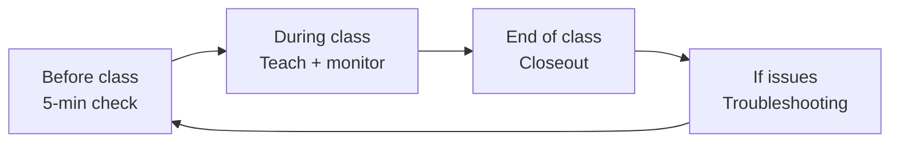

# Non-Developer Guide (Teachers and School Staff)

If you are not writing code, start here.

You do not need to read every docs file. For normal classroom use, this page plus `docs/TEACHER_PORTAL.md` is enough.

## What this system does

- Students join with a class code and display name.
- Teachers run classes and review work in the Teacher Portal (`/teach`).
- The Homework Helper gives hints inside lessons.

## 5-minute startup check (before class)

1. Open the site homepage.
2. Open `/teach` and confirm your teacher login works.
3. Open your class and confirm students can join.
4. Open one lesson and test the Helper once.
5. Confirm submission inbox is visible for your upload lesson.

If any step fails, use `docs/TROUBLESHOOTING.md`.

## During class: what to do

1. Open your class in `/teach`.
2. In `Lesson Tracker`, open only the lesson you are teaching now.
3. Adjust lesson release (open/lock/date) as needed.
4. Use `Helper tuning` in that lesson row if you want to narrow helper focus.
5. Review missing submissions from the dropbox links.

Deep walkthrough: `docs/TEACHER_PORTAL.md`

## End of class: quick closeout

1. Review missing submissions.
2. Rename student entries if needed.
3. Lock lessons or set next lesson date.
4. Export/check submissions if this is an assessment day.

## Common problems (plain language)

- "Students cannot join":
  check class code and whether class is locked.
- "Helper is not responding":
  check `/helper/healthz` and follow `docs/TROUBLESHOOTING.md`.
- "Teacher page looks empty":
  sections are collapsed by default; open `Lesson Tracker` and `Roster`.
- "Uploads are failing":
  check allowed file types and upload size in module material settings.

## Read only what you need next

- Teacher workflow and screen-by-screen guide: `docs/TEACHER_PORTAL.md`
- Day-1 setup (operators/admins): `docs/DAY1_DEPLOY_CHECKLIST.md`
- Incident recovery: `docs/TROUBLESHOOTING.md`
- Security and privacy boundaries (policy level): `docs/SECURITY.md`
