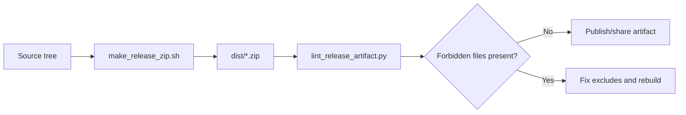

# Releasing

Use this when creating a shareable source archive.



## Build release zip

```bash
cd /srv/lms/app
bash scripts/make_release_zip.sh
```

Optional output path:

```bash
bash scripts/make_release_zip.sh /srv/lms/releases/classhub_release.zip
```

## What is excluded

Release archives intentionally exclude local/runtime artifacts, including:

- `.git/`
- `.venv/`
- `__pycache__/`
- `media/`
- `staticfiles/`
- `data/`
- `.deploy/`
- `compose/.env` and local backup variants (`compose/.env.bak*`, `compose/.env.local*`)
- `dist/`
- common OS metadata (`.DS_Store`, `__MACOSX`)

## Verify artifact contents locally

```bash
export ZIP_PATH="$(ls -t dist/classhub_release_*.zip | head -n1)"
python3 scripts/lint_release_artifact.py "${ZIP_PATH}"
```
