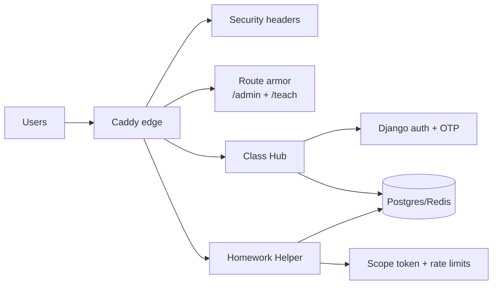

# Security

This page is the practical security baseline for this project.

If you only do three things before production:

1. set strong secrets and `DJANGO_DEBUG=0`
2. require TLS and 2FA for admin + teacher users
3. run `bash scripts/validate_env_secrets.sh`



## Security posture at a glance

| Area | Current posture |
|---|---|
| Student identity | Pseudonymous (`class code + display name`) |
| Teacher/admin auth | Django auth; OTP required by default for `/admin` and `/teach` |
| Transport | Caddy at edge; HTTPS expected in production |
| Service exposure | Postgres/Redis internal-only; Ollama/MinIO localhost-bound on host |
| Browser hardening | Enforced CSP + report-only CSP + Permissions-Policy + Referrer-Policy + frame protections |
| Helper scope protection | Student helper calls require signed `scope_token` |
| Upload access | Not public `/media`; downloads are permission-checked views |
| Auditing | Staff mutations logged as immutable `AuditEvent` rows |
| Helper event ingest | Authenticated internal endpoint (token-gated) |

## Day-1 production checklist

1. Set `DJANGO_DEBUG=0`.
2. Set a strong `DJANGO_SECRET_KEY` (non-default, 32+ chars).
3. Enable HTTPS behavior for domain deployments:
   - `DJANGO_SECURE_SSL_REDIRECT=1`
   - `DJANGO_SECURE_HSTS_SECONDS` (recommend `>=31536000` after verification)
   - `DJANGO_SECURE_HSTS_INCLUDE_SUBDOMAINS=1` only when all subdomains are HTTPS-ready
4. Keep `DJANGO_ADMIN_2FA_REQUIRED=1`.
5. Keep `DJANGO_TEACHER_2FA_REQUIRED=1`.
6. Set deployment timezone (for lesson release dates):
   - `DJANGO_TIME_ZONE=America/Chicago` (or your local timezone)
7. If using separate asset subdomain under same parent domain, set cookie domains:
   - `DJANGO_SESSION_COOKIE_DOMAIN=.yourdomain.tld`
   - `DJANGO_CSRF_COOKIE_DOMAIN=.yourdomain.tld`
8. Validate secrets and guardrails:
   - `bash scripts/validate_env_secrets.sh`
9. Confirm edge request size limits are set:
   - `CADDY_CLASSHUB_MAX_BODY`
   - `CADDY_HELPER_MAX_BODY`
10. Set a strong cross-service event token:
   - `CLASSHUB_INTERNAL_EVENTS_TOKEN`

## Authentication and authorization boundaries

- Students do not have passwords in MVP.
- Teachers should be `is_staff=True`, `is_superuser=False` for daily use.
- `/teach/*` requires OTP-verified staff session when `DJANGO_TEACHER_2FA_REQUIRED=1`.
- Superusers should be limited to operational tasks.
- Helper chat requires either:
  - valid student classroom session, or
  - authenticated staff session.
- Student helper requests must include a valid signed scope token.
- Staff can also be forced to require signed scope tokens:
  - `HELPER_REQUIRE_SCOPE_TOKEN_FOR_STAFF=1`

Admin 2FA bootstrap command:

```bash
docker compose exec classhub_web python manage.py bootstrap_admin_otp --username <admin_username> --with-static-backup
```

## Network and proxy trust model

- Caddy is the public edge.
- Postgres and Redis are not published on host ports.
- Ollama and MinIO are bound to `127.0.0.1` on the host for local/admin access.
- Proxy header trust is explicit opt-in:
  - `REQUEST_SAFETY_TRUST_PROXY_HEADERS=0` by default
  - set to `1` only when your first-hop proxy is trusted and rewrites `X-Forwarded-*`.

## Proxy armor for teacher/admin routes

Optional Caddy controls for `/admin*` and `/teach*`:

- IP allowlist:
  - `CADDY_STAFF_IP_ALLOWLIST_V4` / `CADDY_STAFF_IP_ALLOWLIST_V6` (defaults allow all)
- Extra `/admin*` basic-auth gate:
  - `CADDY_ADMIN_BASIC_AUTH_ENABLED=1`
  - `CADDY_ADMIN_BASIC_AUTH_USER`
  - `CADDY_ADMIN_BASIC_AUTH_HASH` (bcrypt hash)

These controls are additive to Django auth + OTP.

## Data handling and retention

### Student submissions

- Stored under `data/classhub_uploads/`.
- Not served as public static media.
- Access is permission-checked (`/submission/<id>/download`).
- Files use randomized server-side names; original filename is metadata only.
- Upload checks now include lightweight content validation (for example `.sb3` must be a valid zip with `project.json`).
- File cleanup signals remove stored files on row delete/cascade delete and file replacement.

### Lesson assets

- Lesson assets are permission-checked (`/lesson-asset/<id>/download`).
- Unsafe file types (for example `.html`) are forced to download, not inline render.
- Inline rendering is restricted to allow-listed media/PDF types and includes `X-Content-Type-Options: nosniff`.
- Optional: set `CLASSHUB_ASSET_BASE_URL` to serve lesson asset/video links from a separate origin.

Retention commands:

```bash
python manage.py prune_submissions --older-than-days <N>
python manage.py prune_student_events --older-than-days <N>
python manage.py prune_student_events --older-than-days <N> --export-csv /path/to/student_events_before_prune.csv
python manage.py scavenge_orphan_uploads
```

Scheduled maintenance entrypoint:

```bash
bash scripts/retention_maintenance.sh --compose-mode prod
```

### Event logging

- `AuditEvent` logs staff actions in `/teach/*`.
- `StudentEvent` stores metadata (status/request IDs/timing) only.
- No raw helper prompt text and no file contents are stored in `StudentEvent.details`.

## Helper-specific controls

- Unsigned helper scope fields (`context/topics/allowed_topics/reference`) are ignored.
- Helper access telemetry is forwarded to Class Hub via authenticated internal endpoint:
  - `CLASSHUB_INTERNAL_EVENTS_URL`
  - `CLASSHUB_INTERNAL_EVENTS_TOKEN`
- Student helper session-table checks are configurable:
  - default: fail-open when classhub tables are unavailable
  - production hardening option: `HELPER_REQUIRE_CLASSHUB_TABLE=1` (fail-closed)
- Local LLM (`Ollama`) keeps inference on your infrastructure, but logs and prompt handling still require governance.

## Upload malware scanning (optional)

Enable command-based scanning (for example ClamAV):

- `CLASSHUB_UPLOAD_SCAN_ENABLED=1`
- `CLASSHUB_UPLOAD_SCAN_COMMAND` (example: `clamscan --no-summary --stdout`)
- `CLASSHUB_UPLOAD_SCAN_FAIL_CLOSED=1` to block uploads on scanner errors/timeouts

## CSP and browser security headers

Class Hub and Homework Helper attach these headers by default:

- `Content-Security-Policy` (enforced)
- `Content-Security-Policy-Report-Only` (for visibility while tuning)
- `Permissions-Policy`
- `Referrer-Policy`
- `X-Frame-Options`

Primary knobs:

- `DJANGO_CSP_POLICY`
- `DJANGO_CSP_REPORT_ONLY_POLICY`
- `DJANGO_PERMISSIONS_POLICY`
- `DJANGO_SECURE_REFERRER_POLICY`

Rollout strategy:

1. Keep report-only enabled while reviewing violations.
2. Tighten directives (especially `script-src`, `style-src`, `connect-src`, `frame-src`).
3. Keep enforced + report-only in parallel until violation noise stabilizes.

Embed notes:

- YouTube embeds require `frame-src https://www.youtube.com https://www.youtube-nocookie.com`.
- Separate asset origins require matching updates in `img-src`, `media-src`, and `connect-src`.

## Site degradation modes

`CLASSHUB_SITE_MODE` can narrow behavior during incidents:

- `normal`
- `read-only` (uploads/write actions blocked)
- `join-only` (student entry paths available, heavy routes paused)
- `maintenance` (student-facing routes paused)

Optional operator message override:

- `CLASSHUB_SITE_MODE_MESSAGE`

## Future hardening candidates

- Google SSO for teacher accounts.
- Separate databases per service if isolation requirements increase.
- Move to `RUN_MIGRATIONS_ON_START=0` everywhere once your deployment path always runs explicit migration steps.
