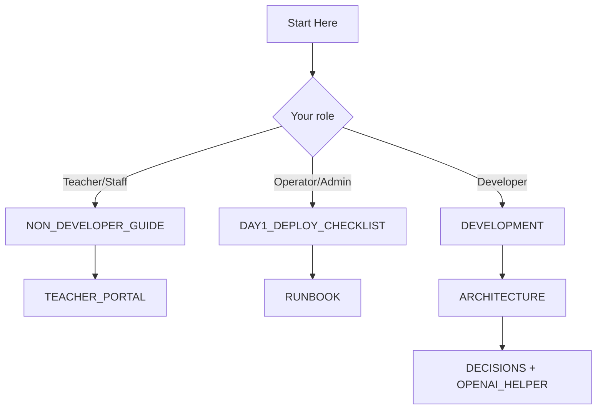

# Start Here

Use this page to pick one path. Do not read everything.

## Fast path by role

### I am a teacher or school staff member (non-developer)
1. `docs/NON_DEVELOPER_GUIDE.md`
2. `docs/TEACHER_PORTAL.md`
3. `docs/TROUBLESHOOTING.md` (only when needed)

### I run the server (operator/admin)
1. `docs/DAY1_DEPLOY_CHECKLIST.md`
2. `docs/RUNBOOK.md`
3. `docs/TROUBLESHOOTING.md`
4. `docs/DISASTER_RECOVERY.md`

### I build features (developer)
1. `docs/DEVELOPMENT.md`
2. `docs/ARCHITECTURE.md`
3. `docs/DECISIONS.md`
4. `docs/OPENAI_HELPER.md`

## Common URLs

- Student join: `/`
- Student class view: `/student`
- Teacher portal: `/teach`
- Admin login: `/admin/login/`
- Class Hub health: `/healthz`
- Helper health: `/helper/healthz`

## Common commands

- Full health check: `bash scripts/system_doctor.sh`
- Guardrailed deploy: `bash scripts/deploy_with_smoke.sh`
- Local quickstart: `README.md#quickstart-local`

## If you're overwhelmed

Read only one page next:

- Teachers/staff: `docs/NON_DEVELOPER_GUIDE.md`
- Operators: `docs/RUNBOOK.md`
- Developers: `docs/DEVELOPMENT.md`
