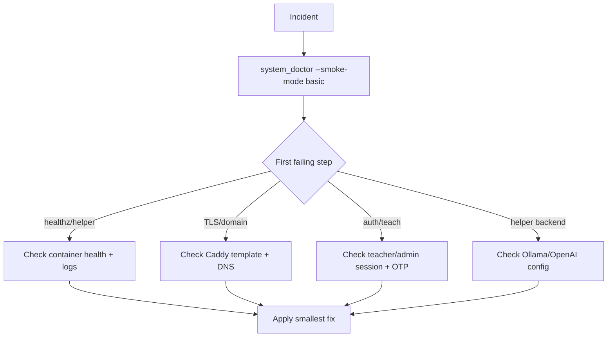

# Troubleshooting Guide

Use this page when something is broken right now.

Flow:

1. confirm failure once
2. capture logs
3. classify symptom
4. apply smallest reversible fix



## 3-minute baseline

```bash
cd /srv/lms/app
bash scripts/system_doctor.sh --smoke-mode basic
```

If this fails early, fix the first failing step before changing anything else.

## Fast triage commands

```bash
cd /srv/lms/app/compose
docker compose ps
curl -I http://localhost/healthz
curl -I http://localhost/helper/healthz
docker compose logs --tail=200 classhub_web helper_web caddy
```

## Symptom index

| Symptom | Check first | Most likely area |
|---|---|---|
| Site not loading over HTTPS | Caddy logs + `.env` domain/template | Edge routing/TLS |
| `/helper/chat` failing (502 / `ollama_error`) | `helper_web` logs + Ollama tags | Helper backend/model |
| Teacher login smoke fails | smoke credentials + login response path | Auth/config mismatch |
| Container unhealthy/restarting | service logs + DB auth | Boot/runtime dependency |
| Helper returns policy redirect unexpectedly | topic filter mode + scope context | Policy config |
| Admin blocked by OTP | admin device enrollment | Auth hardening |
| Content missing after reset/rebuild | class/module records | Data reset/reseed |

## Symptom: site does not load over HTTPS

Common causes:

- wrong Caddy template mounted
- wrong `DOMAIN`
- ACME/DNS mismatch

Checks:

```bash
cd /srv/lms/app/compose
docker inspect classhub_caddy --format '{{range .Mounts}}{{println .Source "->" .Destination}}{{end}}'
docker compose logs --tail=200 caddy
grep -E '^(CADDYFILE_TEMPLATE|DOMAIN)=' .env
```

Look for:

- expected template (`Caddyfile.domain` or `Caddyfile.domain.assets` for public TLS)
- correct domain in logs and `.env`
- ACME identifier/certificate errors

## Symptom: `/helper/chat` fails with 502 or `ollama_error`

Common causes:

- Ollama not ready
- model not pulled
- `OLLAMA_BASE_URL` mismatch
- helper timeout too strict

Checks:

```bash
cd /srv/lms/app/compose
docker compose logs --tail=200 helper_web
docker compose logs --tail=200 classhub_ollama
curl http://localhost:11434/api/tags
docker compose exec -T helper_web env | grep -E '^(OLLAMA_BASE_URL|OLLAMA_MODEL|OLLAMA_TIMEOUT_SECONDS|HELPER_LLM_BACKEND)='
```

Fix pattern:

```bash
cd /srv/lms/app/compose
docker compose exec ollama ollama pull llama3.2:1b
docker compose up -d helper_web
```

If using non-compose Ollama, ensure `OLLAMA_BASE_URL` points to a host reachable from containers.

## Symptom: smoke says teacher login failed

Example failure signal: `teacher login returned 200`.

Common causes:

- smoke credentials not present or stale
- login route returns form again instead of redirect/session success
- CSRF/host/cookie settings drift

Checks:

```bash
cd /srv/lms/app/compose
grep -E '^(SMOKE_|DJANGO_ALLOWED_HOSTS|CSRF_TRUSTED_ORIGINS)=' .env
docker compose logs --tail=200 classhub_web
```

Then re-run strict smoke:

```bash
cd /srv/lms/app
bash scripts/smoke_check.sh --strict
```

## Symptom: helper or classhub container unhealthy/restarting

Common causes:

- DB credential mismatch
- migration/import-time failure
- route/view symbol mismatch after partial deploy

Checks:

```bash
cd /srv/lms/app/compose
docker compose ps -a
docker compose logs --tail=200 helper_web
docker compose logs --tail=200 classhub_web
```

Look for:

- `password authentication failed`
- migration errors
- import/attribute errors

## Symptom: helper tests fail with `current transaction is aborted`

Common cause:

- helper best-effort classhub table access in environments missing classhub tables

Recovery:

```bash
cd /srv/lms/app/compose
docker compose up -d --build helper_web
docker compose exec -T helper_web python manage.py test tutor.tests.HelperChatAuthTests
docker compose exec -T helper_web python manage.py test tutor.tests
```

Interpretation:

- warning logs about missing classhub tables can be expected
- hard failure is persistent transaction-aborted state on later queries

## Symptom: teacher invite email fails

Common causes:

- SMTP host typo
- DNS failure in container
- provider SMTP AUTH policy restrictions

Checks:

```bash
cd /srv/lms/app/compose
grep -nE '^(DJANGO_EMAIL_|TEACHER_INVITE_FROM_EMAIL)=' .env
docker compose exec -T classhub_web env | grep -E '^(DJANGO_EMAIL_|TEACHER_INVITE_FROM_EMAIL)'
docker compose exec -T classhub_web python - <<'PY'
import os, socket
host = os.getenv("DJANGO_EMAIL_HOST","")
print("HOST:", host)
print("DNS:", socket.gethostbyname(host))
PY
```

Office 365 baseline:

- host `smtp.office365.com`
- port `587`
- `DJANGO_EMAIL_USE_TLS=1`

## Symptom: helper returns policy redirect instead of answer

Common cause:

- strict topic filtering and prompt outside allowed scope

Check:

```bash
cd /srv/lms/app/compose
docker compose exec -T helper_web env | grep -E '^HELPER_TOPIC_FILTER_MODE='
```

Behavior:

- `strict` intentionally short-circuits out-of-scope prompts
- `soft` is less restrictive

## Symptom: admin login blocked by OTP requirement

Cause:

- admin 2FA enforced with no enrolled device

Fix:

```bash
cd /srv/lms/app/compose
docker compose exec classhub_web python manage.py bootstrap_admin_otp --username <admin_username> --with-static-backup
```

If no superuser exists:

```bash
docker compose exec classhub_web python manage.py createsuperuser
```

## Symptom: `/teach` redirects to `/teach/2fa/setup`

Cause:

- staff account is authenticated but not OTP-verified
- `DJANGO_TEACHER_2FA_REQUIRED=1` is enabled (default)

Fix:

1. Complete setup at `/teach/2fa/setup` for that account.
2. If the account has no device yet, enroll one with the QR/manual secret flow.
3. If this is temporary bootstrap only, set `DJANGO_TEACHER_2FA_REQUIRED=0`, restart, then re-enable after enrollment.

## Symptom: class content disappeared after rebuild/reset

Cause:

- DB or volume reset removed class/module/material records

Recovery:

```bash
cd /srv/lms/app
scripts/rebuild_coursepack.sh --course-slug piper_scratch_12_session --create-class
```

Then verify in `/teach` and `/student`.

## Symptom: CI dependency security job fails (`pip-audit`)

Cause:

- pinned package below a fixed advisory version

Fix pattern:

1. bump dependency pin
2. rebuild services
3. rerun service tests
4. rerun CI/security workflow

Verification pattern:

```bash
cd /srv/lms/app/compose
docker compose up -d --build classhub_web helper_web
docker compose exec -T classhub_web python manage.py test hub.tests hub.tests_services
docker compose exec -T helper_web python manage.py test tutor.tests
```

## Escalation criteria

Escalate to full incident workflow (`docs/DISASTER_RECOVERY.md`) when:

- health checks fail after restart and config verification
- migrations fail in production
- repeated auth failures with no config drift
- data integrity concerns (missing submissions/classes unexpectedly)

## Anti-patterns to avoid

1. Rebuilding everything before capturing first-failure logs.
2. Making multiple config changes at once.
3. Ignoring warning logs without classification.
4. Skipping health endpoint checks.
